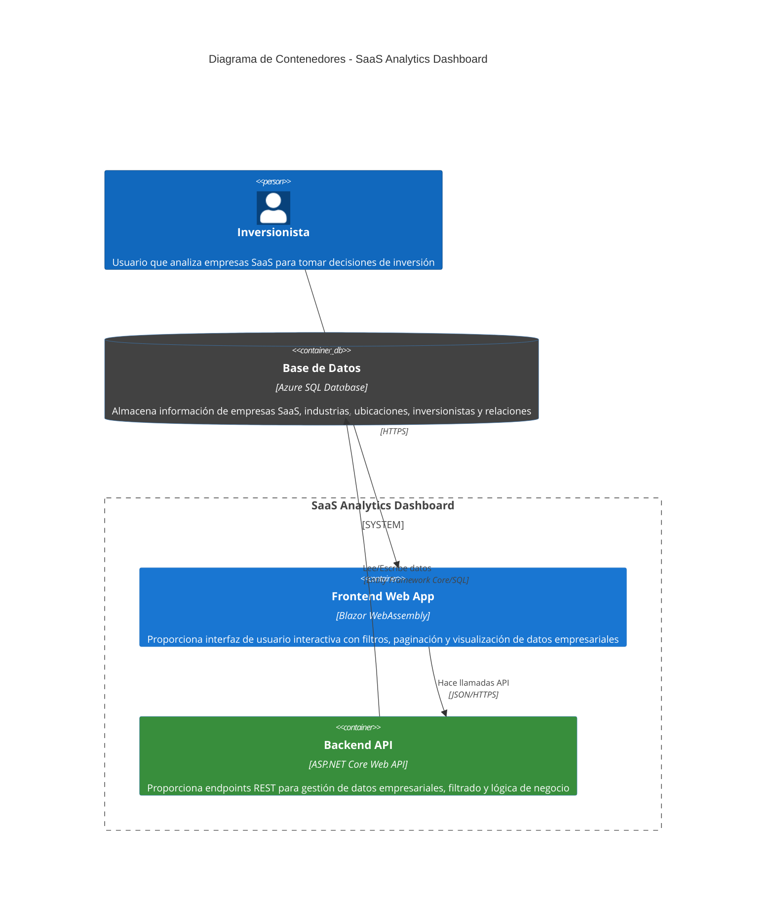

# Diagrama de Contenedores C4 - SaaS Analytics Dashboard

## Propósito y Audiencia

**Propósito:** Este diagrama de contenedores muestra la arquitectura de alto nivel del sistema SaaS Analytics Dashboard, descomponiendo el sistema en contenedores (aplicaciones, servicios, bases de datos) y las tecnologías utilizadas.

**Audiencia:** Arquitectos de software, desarrolladores senior, DevOps engineers y equipos técnicos responsables del diseño e implementación del sistema.

## Diagrama de Contenedores

## Descripción de Contenedores

### Frontend Web App (Blazor WebAssembly)

**Tecnología:** Blazor WebAssembly con C# y .NET 8
**Responsabilidades:**
- Renderizado de interfaz de usuario en el navegador del cliente
- Gestión de estado local (filtros activos, paginación)
- Comunicación HTTP con Backend API
- Validación básica de entrada del usuario
- Experiencia de usuario responsiva y interactiva

**Características Técnicas:**
- Single Page Application (SPA) ejecutándose en WebAssembly
- Bootstrap para estilos y componentes UI responsivos
- HttpClient para comunicación con API REST
- Paginación del lado cliente (25 registros por página)

### Backend API (ASP.NET Core Web API)

**Tecnología:** ASP.NET Core Web API con C# y .NET 8
**Responsabilidades:**
- Exposición de endpoints REST para operaciones CRUD
- Lógica de negocio y validaciones de datos
- Mapeo entre entidades de base de datos y DTOs
- Filtrado de datos por industria y ubicación
- Manejo de errores y logging centralizado

**Características Técnicas:**
- Arquitectura por capas (Controllers → Services → Repositories)
- Entity Framework Core para acceso a datos
- Inyección de dependencias nativa
- Middleware de manejo de errores y CORS
- Documentación automática con Swagger/OpenAPI

### Base de Datos (Azure SQL Database)

**Tecnología:** Microsoft SQL Server en Azure (PaaS)
**Responsabilidades:**
- Almacenamiento persistente de datos empresariales
- Gestión de relaciones entre entidades
- Optimización de consultas y índices
- Backup automático y alta disponibilidad
- Seguridad a nivel de base de datos

## Protocolos de Comunicación

### Cliente ↔ Frontend Web App
- **Protocolo:** HTTPS
- **Formato:** HTML, CSS, JavaScript (generado por Blazor)
- **Patrón:** Interacción directa en navegador

### Frontend Web App ↔ Backend API  
- **Protocolo:** HTTPS/REST
- **Formato:** JSON
- **Métodos:** GET para consultas, filtrado y obtención de datos
- **Autenticación:** Pendiente de definir (posiblemente JWT/Bearer tokens)

### Backend API ↔ Base de Datos
- **Protocolo:** SQL sobre TLS/SSL
- **ORM:** Entity Framework Core
- **Patrón:** Repository pattern para abstracción de datos
- **Conexión:** Connection pooling para optimización de performance

## Flujo de Datos

1. **Carga Inicial:** Frontend solicita datos completos de empresas al Backend API
2. **Filtrado:** Frontend envía parámetros de filtro (industria, ubicación) al Backend
3. **Procesamiento:** Backend ejecuta consultas filtradas en Base de Datos via EF Core
4. **Respuesta:** Backend devuelve DTOs serializados en JSON al Frontend
5. **Visualización:** Frontend aplica paginación local y renderiza datos en componentes UI