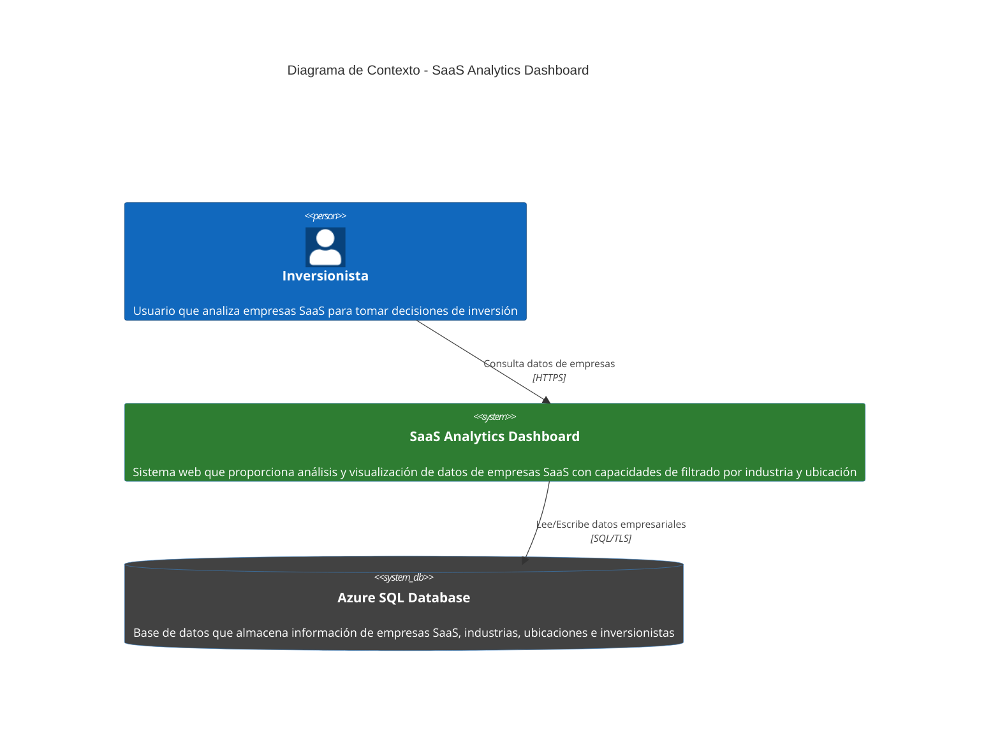

# Diagrama de Contexto C4 - SaaS Analytics Dashboard

## Propósito y Audiencia

**Propósito:** Este diagrama de contexto muestra la vista de más alto nivel del sistema SaaS Analytics Dashboard, identificando a los usuarios principales y sistemas externos con los que interactúa.

**Audiencia:** Stakeholders ejecutivos, arquitectos de software, product managers y cualquier persona que necesite entender el scope y las interacciones externas del sistema.

## Diagrama de Contexto

## Descripción de Elementos

### Actores

**Inversionista**
- Usuario principal del sistema
- Requiere información analítica para tomar decisiones de inversión
- Interactúa con el sistema a través de navegador web

### Sistemas

**SaaS Analytics Dashboard**
- Sistema central que proporciona análisis de empresas SaaS
- Interfaz web responsiva construida con Blazor WebAssembly
- Ofrece filtrado por industria, ubicación y paginación de resultados
- Presenta dashboards interactivos con métricas clave

**Azure SQL Database**
- Sistema de almacenamiento externo
- Contiene datos maestros de empresas, industrias, ubicaciones
- Gestiona relaciones entre empresas e inversionistas
- Proporciona alta disponibilidad y backup automático

## Flujos de Interacción

1. **Consulta de Datos:** El inversionista accede al dashboard web para visualizar información de empresas SaaS
2. **Filtrado:** Aplica filtros por industria y/o ubicación para refinar los resultados
3. **Análisis:** Examina métricas y datos detallados de empresas de interés
4. **Navegación:** Utiliza controles de paginación para explorar datasets completos