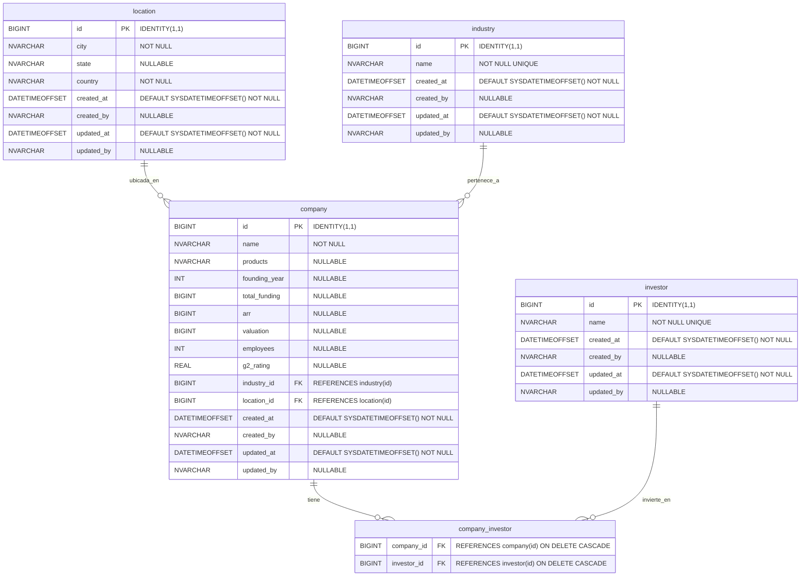

# Documentación del Modelo de Datos - SaaS Analytics Dashboard

## Diagrama de Entidad-Relación

## Descripción de Tablas Principales

### Tabla `location`
**Propósito:** Almacena ubicaciones normalizadas de las empresas SaaS.

| Campo | Tipo | Restricciones | Descripción |
|-------|------|---------------|-------------|
| id | BIGINT | PRIMARY KEY, IDENTITY(1,1) | Identificador único autoincrementable |
| city | NVARCHAR(MAX) | NOT NULL | Ciudad donde se ubica la empresa |
| state | NVARCHAR(MAX) | NULLABLE | Estado/Provincia (opcional para países sin estados) |
| country | NVARCHAR(MAX) | NOT NULL | País de ubicación |
| created_at | DATETIMEOFFSET | DEFAULT SYSDATETIMEOFFSET() NOT NULL | Timestamp de creación |
| created_by | NVARCHAR(MAX) | NULLABLE | Usuario que creó el registro |
| updated_at | DATETIMEOFFSET | DEFAULT SYSDATETIMEOFFSET() NOT NULL | Timestamp de última actualización |
| updated_by | NVARCHAR(MAX) | NULLABLE | Usuario que actualizó el registro |

### Tabla `industry`
**Propósito:** Catálogo de industrias únicas para clasificación de empresas.

| Campo | Tipo | Restricciones | Descripción |
|-------|------|---------------|-------------|
| id | BIGINT | PRIMARY KEY, IDENTITY(1,1) | Identificador único autoincrementable |
| name | NVARCHAR(255) | NOT NULL, UNIQUE | Nombre de la industria (único) |
| created_at | DATETIMEOFFSET | DEFAULT SYSDATETIMEOFFSET() NOT NULL | Timestamp de creación |
| created_by | NVARCHAR(MAX) | NULLABLE | Usuario que creó el registro |
| updated_at | DATETIMEOFFSET | DEFAULT SYSDATETIMEOFFSET() NOT NULL | Timestamp de última actualización |
| updated_by | NVARCHAR(MAX) | NULLABLE | Usuario que actualizó el registro |

### Tabla `investor`
**Propósito:** Registro de inversores únicos que participan en empresas SaaS.

| Campo | Tipo | Restricciones | Descripción |
|-------|------|---------------|-------------|
| id | BIGINT | PRIMARY KEY, IDENTITY(1,1) | Identificador único autoincrementable |
| name | NVARCHAR(255) | NOT NULL, UNIQUE | Nombre del inversor (único) |
| created_at | DATETIMEOFFSET | DEFAULT SYSDATETIMEOFFSET() NOT NULL | Timestamp de creación |
| created_by | NVARCHAR(MAX) | NULLABLE | Usuario que creó el registro |
| updated_at | DATETIMEOFFSET | DEFAULT SYSDATETIMEOFFSET() NOT NULL | Timestamp de última actualización |
| updated_by | NVARCHAR(MAX) | NULLABLE | Usuario que actualizó el registro |

### Tabla `company` (Principal)
**Propósito:** Almacena información detallada de empresas SaaS para análisis e inversión.

| Campo | Tipo | Restricciones | Descripción |
|-------|------|---------------|-------------|
| id | BIGINT | PRIMARY KEY, IDENTITY(1,1) | Identificador único autoincrementable |
| name | NVARCHAR(MAX) | NOT NULL | Nombre de la empresa |
| products | NVARCHAR(MAX) | NULLABLE | Descripción de productos/servicios |
| founding_year | INT | NULLABLE | Año de fundación |
| total_funding | BIGINT | NULLABLE | Financiación total recibida (USD) |
| arr | BIGINT | NULLABLE | Annual Recurring Revenue (USD) |
| valuation | BIGINT | NULLABLE | Valoración actual de la empresa (USD) |
| employees | INT | NULLABLE | Número total de empleados |
| g2_rating | REAL | NULLABLE | Calificación en G2 (escala decimal) |
| industry_id | BIGINT | FK → industry(id) | Referencia a la industria |
| location_id | BIGINT | FK → location(id) | Referencia a la ubicación |
| created_at | DATETIMEOFFSET | DEFAULT SYSDATETIMEOFFSET() NOT NULL | Timestamp de creación |
| created_by | NVARCHAR(MAX) | NULLABLE | Usuario que creó el registro |
| updated_at | DATETIMEOFFSET | DEFAULT SYSDATETIMEOFFSET() NOT NULL | Timestamp de última actualización |
| updated_by | NVARCHAR(MAX) | NULLABLE | Usuario que actualizó el registro |

### Tabla `company_investor` (Relación)
**Propósito:** Tabla de unión para relación muchos-a-muchos entre empresas e inversores.

| Campo | Tipo | Restricciones | Descripción |
|-------|------|---------------|-------------|
| company_id | BIGINT | FK → company(id), ON DELETE CASCADE | Referencia a la empresa |
| investor_id | BIGINT | FK → investor(id), ON DELETE CASCADE | Referencia al inversor |
| (company_id, investor_id) | - | PRIMARY KEY | Clave primaria compuesta |

## Tipos de Datos y Consideraciones

### Tipos de Datos Utilizados

- **BIGINT:** Para identificadores y valores monetarios grandes (funding, ARR, valuation)
- **INT:** Para valores enteros medianos (año, empleados)
- **NVARCHAR(MAX):** Para texto de longitud variable sin límite específico
- **NVARCHAR(255):** Para campos con restricción de longitud (nombres únicos)
- **REAL:** Para valores decimales de precisión simple (G2 rating)
- **DATETIMEOFFSET:** Para timestamps con información de zona horaria

### Restricciones Implementadas

- **Claves Primarias:** Todas las tablas tienen claves primarias autoincrementables
- **Unicidad:** Nombres de industrias e inversores son únicos
- **Integridad Referencial:** Foreign keys con restricciones de cascada
- **Valores Por Defecto:** Timestamps automáticos en creación y actualización
- **Campos Obligatorios:** Solo campos esenciales marcados como NOT NULL